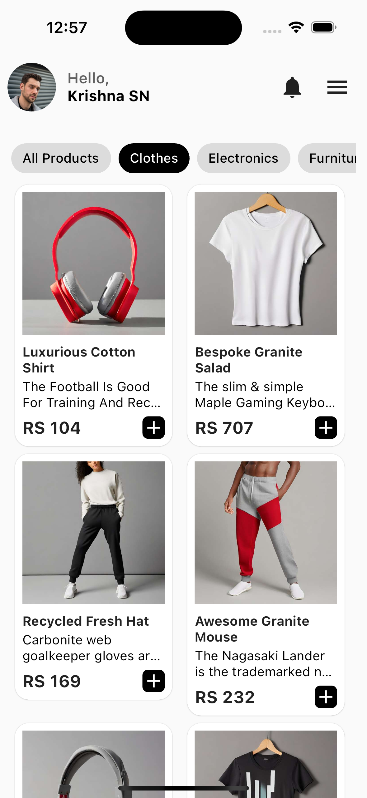

# LiftU.Tech Flutter E-commerce App

This Flutter application is created for assignment round of LiftU.tech and is designed to display product categories and their respective items using data retrieved from the [Platzi Fake API](https://fakeapi.platzi.com/en/rest/products). The app features a clean and user-friendly interface inspired by modern e-commerce applications.

## Features

- **Categories Display**: The home screen displays a list of product categories, allowing users to explore different types of items.

- **Item Listing**: Upon selecting a category, the app fetches and displays a list of products within that category.

- **Product Details**: Users can view detailed information about a specific product by tapping on it.

- **API Integration**: The app seamlessly integrates with the Platzi Fake API to fetch real product data, including categories and products.

- **State Management**: To ensure a smooth user experience, I have used provider state management for efficient data retrieval and UI updates.

## Screenshots

### Home Screen


### Category Screen


## Product Detail Screen


## Getting Started

Follow these steps to get the app up and running on your local machine:

1. **Clone the Repository**:

   ```shell
   git clone https://github.com/your-username/LiftU.Tech-Flutter-Ecommerce-App.git
   
2. **Navigate to the Project Directory**:
   ```shell

    cd shopping-application
3. **Install Dependencies**:
    ```shell
  
    flutter pub get
4. **Run the App**:
   ```shell

    flutter run
## API Integration

The app uses the [Platzi Fake API](https://fakeapi.platzi.com/en/rest/products) for product and category data. It demonstrates how to make API calls in Flutter and manage asynchronous operations efficiently.

```Note: Some of the product images are damage and to avoid app crash necessary error handing methods are added for more details check Image.network() code``` 

## Libraries and Packages Used

* Flutter
* Provider: State management
* http: HTTP requests
